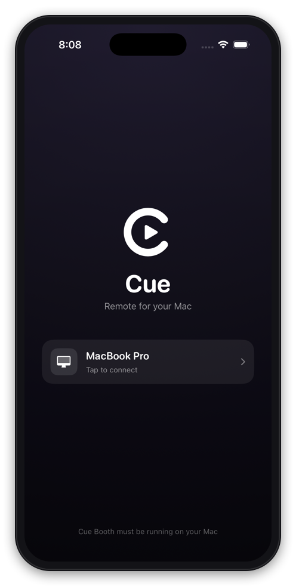
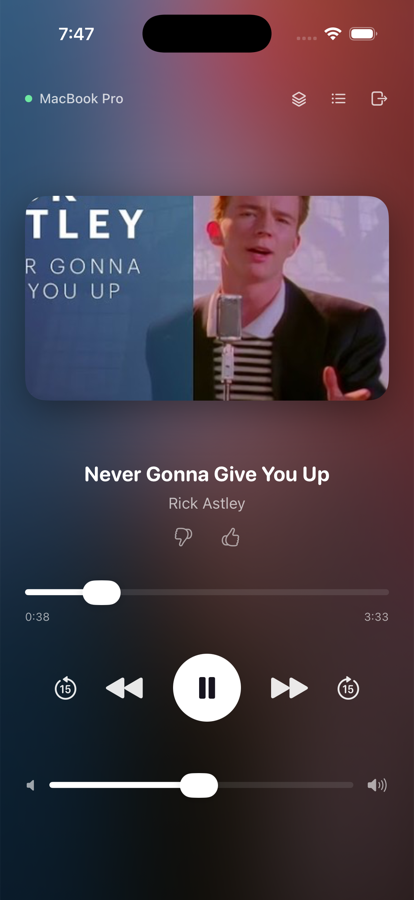
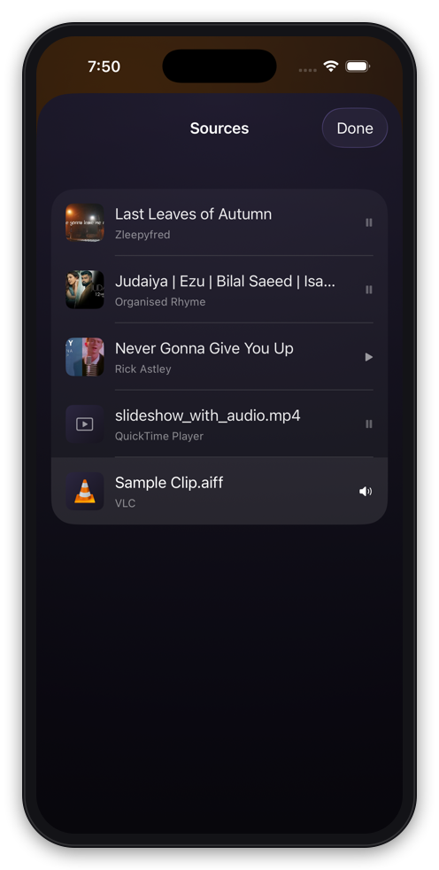
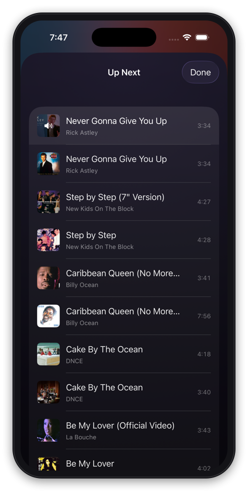
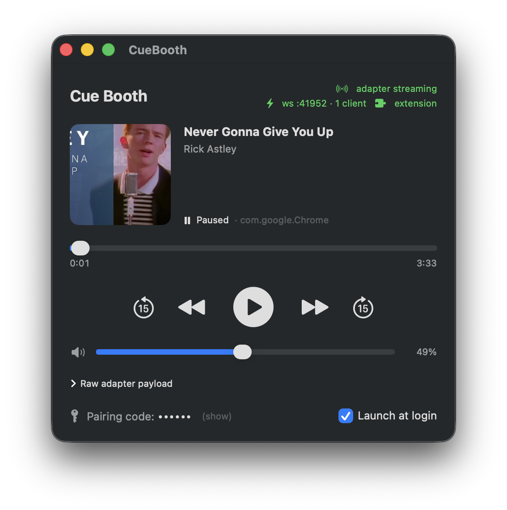

<p align="center">
  
</p>

<h1 align="center">Cue</h1>

<p align="center">
  <strong>Control everything playing on your Mac from your iPhone.</strong><br>
  Netflix, YouTube Music, Prime, Hotstar, VLC, QuickTime — one remote.
</p>

<p align="center">
  
  
  
  
</p>

Cue is a pair of apps: **Cue Booth**, a macOS menu bar app that watches and drives whatever is playing, and **Cue**, an iPhone app that talks to it over your local network. No cloud, no account, no data leaves your machine.

<p align="center">
  
  
  
  
</p>

<p align="center">
  <em>Find your Mac · control what's playing · switch between everything open · browse the queue</em>
</p>

---

## Why it exists

macOS already knows what's playing — that's how the Now Playing widget works. But it only exposes *one* thing at a time, and browser-based video barely participates. Cue fills the gaps: it reads the system's now-playing state, adds what the system can't see (QuickTime, VLC, browser tabs sitting paused), and gives you one remote for all of it.

The result: your phone shows the actual show poster while Netflix plays, the real album art for YouTube Music, and a list of everything open so you can switch between them without touching the Mac.

## Features

- **Real transport control** — play/pause, next/previous, ±15s, seek, and system volume
- **Correct artwork, everywhere** — full-resolution album art from the page, TMDB posters for film and TV, extracted video frames for local files, and platform logos as a fallback
- **Proper titles** — real show names and episode numbers, not "Netflix"
- **Source picker** — see every browser tab, QuickTime document and VLC item that's open, playing or paused, and switch with one tap
- **Fullscreen from the couch** — one tap brings the player forward and puts the video into real fullscreen, in the browser as well as QuickTime and VLC
- **Queue browsing** — YouTube Music and YouTube playlists with artwork, plus VLC's playlist
- **Like / dislike** on YouTube Music
- **Lock Screen & Dynamic Island** — a Live Activity with working controls and a progress bar that keeps ticking
- **Hardware volume buttons** control the Mac while the app is open
- **Landscape layout** for the player

<p align="center">
  
</p>

## What works where

| | Play/pause | Next / prev | Seek & ±15s | Artwork | Queue | Fullscreen |
|---|---|---|---|---|---|---|
| YouTube Music | ✅ | ✅ | ✅ | Page art | ✅ | ✅ |
| YouTube | ✅ | ✅ | ✅ | Page art | ✅ | ✅ |
| Netflix | ✅ | ✅ ¹ | ✅ | TMDB poster | — | ✅ |
| Hotstar | ✅ | — ² | ✅ | TMDB poster | — | ✅ |
| Prime Video | ✅ | ✅ ¹ | ✅ | TMDB poster | — | ✅ |
| VLC | ✅ | ✅ | ✅ | — | ✅ | ✅ |
| QuickTime | ✅ | — ³ | ✅ | Video frame | — | ✅ |

¹ Clicks the player's own next-episode control.
² Hotstar's player has no next-episode control during playback — verified by enumerating every button it exposes.
³ A single local file has no concept of "next".

---

## Getting started

### Requirements

- macOS 14 or later
- [Xcode](https://developer.apple.com/xcode/) (for the iPhone app) and a free Apple ID
- [Homebrew](https://brew.sh)
- Google Chrome, for browser playback
- An iPhone on the same Wi-Fi network

### 1. Install Cue Booth (macOS)

```bash
git clone https://github.com/nikets40/cue.git
cd cue

# The MediaRemote adapter, which is what lets Booth read now-playing state
brew install media-control

# Builds dist/Cue Booth.app and copies it to /Applications
tools/make-app.sh --install
open "/Applications/Cue Booth.app"
```

Cue Booth lives in the menu bar. Click its icon → **Open Dashboard** to see what it's tracking and to find your pairing code.

> The adapter is copied *into* the app bundle, so once built, Booth no longer depends on Homebrew.

### 2. Install the Chrome extension

The extension is what gives you real show titles, full-resolution artwork, queue browsing and the tab list. Without it, browser playback still works but is limited to what macOS exposes.

1. Open `chrome://extensions`
2. Turn on **Developer mode** (top right)
3. Click **Load unpacked** and select the `chrome-extension/` folder in this repo

> After editing extension files, hit ↻ on the card. You do **not** need to reload your tabs — the extension re-injects itself.

### 3. Build and install the iPhone app

```bash
brew install xcodegen
cd ios
xcodegen generate      # creates Cue.xcodeproj
open Cue.xcodeproj
```

In Xcode:

1. **Settings → Accounts** → add your Apple ID
2. Select the **Cue** target → **Signing & Capabilities** → choose your Personal Team
   (if the bundle ID `com.niket.cue` is taken, change it to anything unique)
3. On your iPhone: **Settings → Privacy & Security → Developer Mode** → on
4. Pick your iPhone in the device menu and press **Run**

Once it's installed the first time, you can redeploy from the terminal without opening Xcode:

```bash
cd ios
xcodebuild -project Cue.xcodeproj -scheme Cue \
  -destination "platform=iOS,id=<your-device-id>" \
  -derivedDataPath .build-dev -allowProvisioningUpdates build
xcrun devicectl device install app --device <your-device-id> \
  .build-dev/Build/Products/Debug-iphoneos/Cue.app
```

Find `<your-device-id>` with `xcrun devicectl list devices`.

> **Free Apple ID note:** the signature expires after 7 days, so the app stops launching and you re-run the install command. A paid account removes this.

### 4. Pair

1. Launch **Cue** on your iPhone — it finds Cue Booth over Bonjour automatically
2. Allow the **local network** prompt (discovery silently fails without it)
3. Enter the 6-digit pairing code from the Booth dashboard (click **show** next to it)

That's it. The code is stored, so you only do this once.

### 5. Allow fullscreen control (Accessibility)

Chrome only enters video fullscreen for input it trusts, and nothing an extension does qualifies — `requestFullscreen()` is refused, and so is a scripted click on the player's own button. Booth works around this by sending a genuine keystroke, which needs one permission:

**System Settings → Privacy & Security → Accessibility → enable *Cue Booth***

Booth asks the first time you use fullscreen. Until you grant it, fullscreen still works — it just fullscreens the browser window instead of the video. QuickTime and VLC don't need this.

### 6. Optional: posters for film and TV

Netflix, Prime and Hotstar don't publish artwork that macOS can see. With a free [TMDB](https://www.themoviedb.org/settings/api) API key, Cue looks up the real poster by show name:

```bash
tools/set-tmdb-key.sh <your-key>
```

Restart Cue Booth afterwards. Either a v3 API key or a v4 read access token works.

### 7. Optional: VLC

VLC is controlled through its web interface, which is off by default:

```bash
# Quit VLC first — it overwrites its config on exit
tools/enable-vlc-http.sh
```

Then start VLC. It'll appear in the source picker.

### 8. Optional: QuickTime

Nothing to configure — but the first time Cue Booth talks to QuickTime, macOS asks for permission to control it. Click **Allow**.

---

## How it works

```
┌─ iPhone: Cue ────────────┐         ┌─ Mac: Cue Booth ─────────────────────┐
│  SwiftUI                 │  LAN    │  WebSocket server + Bonjour          │
│  Bonjour discovery       │◄───────►│                                      │
│  Live Activity           │   ws    │   ├─ MediaRemote adapter (now playing)│
└──────────────────────────┘         │   ├─ CoreAudio (system volume)       │
                                     │   ├─ AppleScript → QuickTime         │
┌─ Chrome: Cue Bridge ─────┐  ws     │   ├─ HTTP → VLC                      │
│  Reads Media Session     │────────►│   ├─ CGEvent keystroke (fullscreen)  │
│  Drives page controls    │         │   └─ TMDB (posters)                  │
└──────────────────────────┘         └──────────────────────────────────────┘
```

Booth pushes a full state snapshot on every change — no diffing, so the phone can't drift out of sync — and the phone sends small commands back. The extension connects as a *provider*: it supplies page metadata and performs DOM actions, and is accepted without the pairing token only because it connects over loopback.

A few things that turned out to be necessary rather than optional:

- **Netflix publishes no Media Session data at all**, and its document title is just "Netflix" — the show name has to be read from the player UI, and remembered, because the title overlay unmounts when the controls fade.
- **Queue rows carry their data in a JS property**, not the DOM: the rendered `` is a lazy-loading placeholder for every off-screen row. That property is invisible to an isolated content script, which is why queue reading runs in the page's own world.
- **QuickTime never registers with Now Playing**, so it's driven entirely through AppleScript and only stands in when nothing else claims playback.
- **Relative seeking drifts badly on streaming players** (a measured +15s once moved playback 84 seconds), so ±15 clicks the player's own jump buttons where they exist.
- **No extension can fullscreen a video.** Chrome requires trusted input, which rules out both `requestFullscreen()` and clicking the site's own button from a script. Booth posts a real `CGEvent` keystroke instead — indistinguishable from your keyboard, because it enters through the OS input stack rather than the page. The extension's job is only to put the right tab in front with focus on its player.

## Repository layout

| Path | What it is |
|---|---|
| `booth/` | Cue Booth, the macOS app (Swift Package) |
| `ios/` | The iPhone app (XcodeGen project) |
| `CueKit/` | Wire protocol shared by both |
| `chrome-extension/` | The Chrome extension |
| `tools/` | Build, packaging and setup scripts |
| `design/` | Design explorations |

## Troubleshooting

**The phone can't find Cue Booth**
Both devices must be on the same network, and the iPhone must have granted local-network permission (Settings → Cue). Check Booth's dashboard shows `ws :41952`.

**Browser playback shows the Chrome icon instead of a poster**
The extension isn't loaded or needs a reload. Check the dashboard header — it shows **extension** in green when connected.

**A show's poster is wrong or missing**
The TMDB key may be unset, or the lookup failed. Note that TMDB's API is blocked by some ISPs; Cue retries and backs off, so it may resolve a moment later.

**Nothing appears for a few seconds after starting a video**
Chrome takes roughly 15 seconds to register a new tab with macOS Now Playing. That gap is the system's, not Cue's.

**Fullscreen only fullscreens the browser window**
Booth doesn't have Accessibility permission, so it can't send the keystroke Chrome requires. Grant it in System Settings → Privacy & Security → Accessibility (step 5), then try again. Booth logs which path it took.

**The iPhone app stopped launching**
The free-account signature expired (7 days). Re-run the install command in step 3.

## Known limitations

- Only Chrome is supported for browser playback — Safari would need its own extension.
- **Browser fullscreen needs Accessibility permission** (see step 5). Chrome accepts fullscreen only from trusted input, which no extension can produce, so Booth sends a real keystroke instead. Without the grant, Cue falls back to fullscreening the browser window and says so in its log.
- **Fullscreen in VLC needs a video.** On an audio-only track there's no video output, so the command is skipped deliberately rather than silently flipping VLC's internal flag and surprising the next video you open.
- The list of sources covers Chrome, QuickTime and VLC. macOS exposes no way to enumerate every app with paused media, so anything else is invisible unless integrated individually.
- Quick Look previews (space-to-preview in Finder) can't be controlled: they never register with Now Playing and expose no scripting interface.
- Live Activity content updates while the phone is locked depend on the app staying alive; buttons always work.
- The MediaRemote adapter relies on a community workaround for an API Apple restricted in macOS 15.4. It's the most likely thing to break on a future macOS release.

## Development

```bash
# Booth, with its window visible
cd booth && swift run

# Rebuild and reinstall the packaged app
tools/make-app.sh --install

# Regenerate the app icon
swift tools/make-icon.swift ios/Cue/Assets.xcassets/AppIcon.appiconset

# Poke the protocol by hand
swift tools/wstest.swift ws://127.0.0.1:41952 <pairing-code> '{"action":"togglePlayPause"}'
```

`project.md` carries the full development history and the reasoning behind each decision.

## License

[MIT](LICENSE) © Niket Singh
